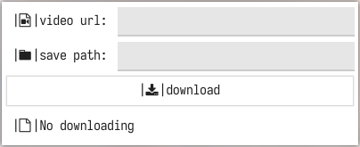

# youget-gui-go

A gui written in Golang for you-get.



## Usage

```shell
./youget-gui
```

Just like the picture above,input the video
url and click `download`,everything is easy!

## How to build

### Install dependencies

you should install  golang first,for example:

#### Debian

```shell
apt install golang-go
```

#### Archlinux

```shell
pacman -S golang
```

then you must install you-get library via `pip install`.

```shell
pip install you-get
```

### Clone

```shell
git clone https://github.com/DHWIDSA/youget-gui-go
```

### Build

#### for linux users

linux:

```shell
go build
```

linux to windows:

```shell
env CC=x86_64-w64-mingw32-gcc CGO_ENABLED=1 GOOS=windows go build -ldflags="-H windowsgui"
```

#### for windows users

```shell
go build -ldflags="-H windowsgui"
```

Thanks laishulu who offers Sarasa-Mono-SC-Nerd font.

[Sarasa-Mono-SC-Nerd](https://github.com/laishulu/Sarasa-Mono-SC-Nerd)
